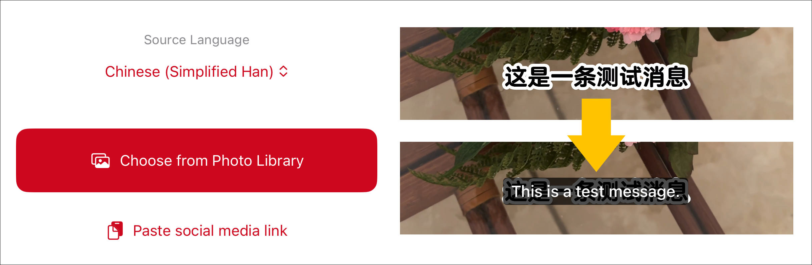

<h1 align="center"> Social Media Translator</h1>

<h3 align="center">iOS app to translate foreign language screenshots and video subtitles</h3>

## How does it work?

1. Choose a photo or video from your photo library, or paste a shared link from social media.

2. The app automatically detects the text and translates it.

3. The translated photo appears or the video plays with subtitles in your language. Enjoy!
